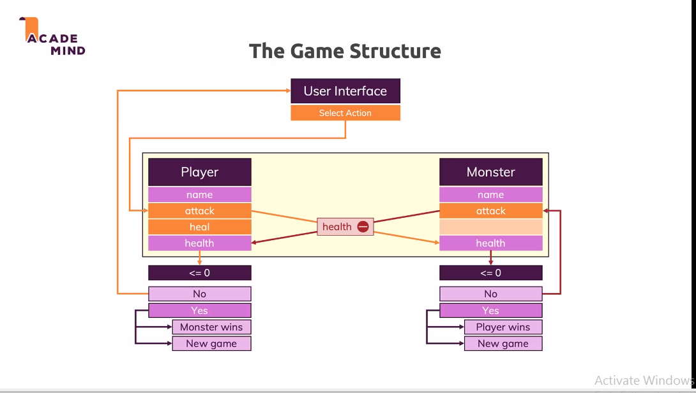
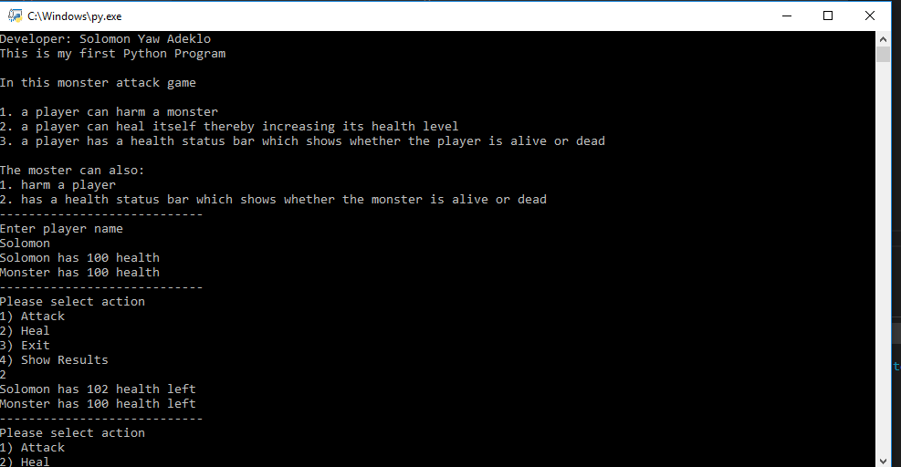
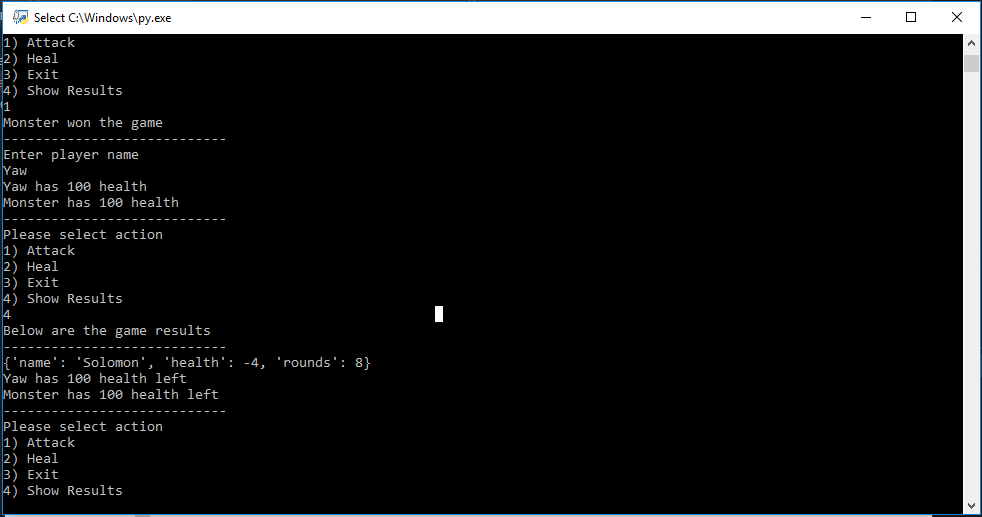
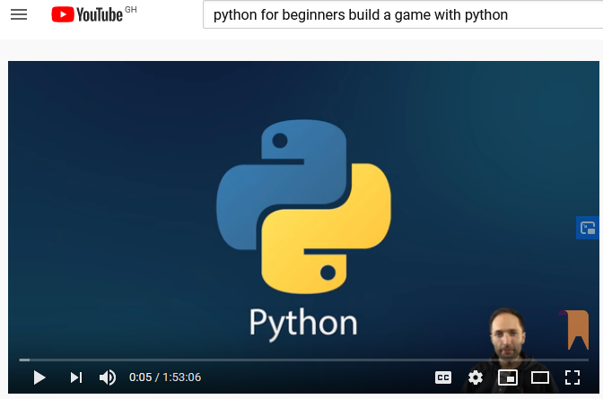

# Monster_Player_Python_Game 

In this monster attack game
1. a player can harm a monster
2. a player can heal itself thereby increasing its health level
3. a player has a health status bar which shows whether the player is alive or dead

The moster can also:
1. harm a player
2. has a health status bar which shows whether the monster is alive or dead

#Below is the tutorial for the game

